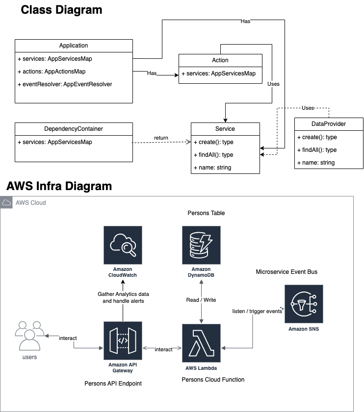

# Serverless Assesment CDK TypeScript project

You should explore the contents of this project. It demonstrates a CDK app with an instance of a stack (`ServerlessAssesmentStack`)
which contains an Amazon SQS queue that is subscribed to an Amazon SNS topic.

The `cdk.json` file tells the CDK Toolkit how to execute your app.

## Useful commands

- `npm run build` compile typescript to js
- `npm run watch` watch for changes and compile
- `npm run test` perform the jest unit tests
- `cdk deploy` deploy this stack to your default AWS account/region
- `cdk diff` compare deployed stack with current state
- `cdk synth` emits the synthesized CloudFormation template

## Class and Infra Diagrams




## Getting started

Please visit https://docs.aws.amazon.com/cdk/v2/guide/getting_started.html before start.

Install npm dependencies:

```bash
$ yarn install
```

Create an AWS CDK stack

```bash
$ cdk synth
$ cdk bootstrap
$ cdk deploy test-assesment-stack

...

 ✅  test-assesment-stack

✨  Deployment time: 33.45s

Outputs:
test-assesment-stack.testpersonsapigwnon200statusalarmarn = arn:aws:cloudwatch:eu-central-1:382605050318:alarm:test-persons-api-gw-non200status-alarm
test-assesment-stack.testpersonsapigwurl = https://dtzcf4540b.execute-api.eu-central-1.amazonaws.com/prod/
test-assesment-stack.testpersonslambdarestapiEndpoint305182FF = https://dtzcf4540b.execute-api.eu-central-1.amazonaws.com/prod/
test-assesment-stack.testpersonstablename = personsTable
Stack ARN:
arn:aws:cloudformation:eu-central-1:382605050318:stack/test-assesment-stack/f7e2d1b0-b44e-11ee-9185-02b196bb435f

✨  Total time: 47.52s
```

After that you will get next output with urls related to infra


## Sample Requests

To add a new person please use:

```bash
curl -X POST \
  https://dtzcf4540b.execute-api.eu-central-1.amazonaws.com/prod/persons \
  -H 'Content-Type: application/json' \
  -H 'Host: dtzcf4540b.execute-api.eu-central-1.amazonaws.com' \
  -d '{
    "firstName": "Dmitry",
    "lastName": "Tuzenkov",
    "phone": "020000001",
    "address": {
      "city": "Amsterdam",
      "country": "Netherlands",
      "houseNumber": "2-1020",
      "postCode": "1083HJ",
      "street": "De Boolelaan"
    }
  }'

```


To get all persons from service:

```bash
curl -X GET \
  https://dtzcf4540b.execute-api.eu-central-1.amazonaws.com/prod/persons \
  -H 'Host: dtzcf4540b.execute-api.eu-central-1.amazonaws.com'

```

